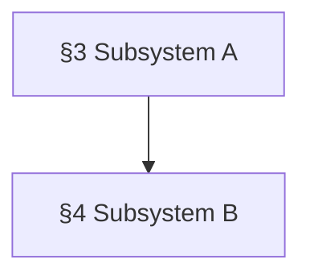

<!--
  TEMPLATE: {{ARCH_DOC}} → write to repo root.
  This is the project's DESIGN CONTRACT. At bootstrap it is a SKELETON — section
  headings with 1-2 sentence stubs. Do NOT write the architecture; it accretes as
  decisions land. Fill the section list from the user's Batch-E answer. Keep
  Appendix A — it is the canonical home for the cross-doc invariant model
  inventory that the area CLAUDE.md table points at. Delete this comment.

  HOW THIS DOC IS USED (carry this discipline into the project):
   - Loaded ON DEMAND, never whole. Sessions reach it via the area CLAUDE.md
     lookup table + `/check-arch <topic>`, which read only the cited section.
   - It is a CONTRACT. Typed models that mirror a section are listed in the area
     CLAUDE.md cross-doc invariants table; a field change requires an edit to the
     matching section in the same round of commits.
   - Orchestrator territory. The implementer never edits it directly — they flag
     a cross-doc change at /tdd Step 9; the orchestrator writes it hot.
   - Phases in {{TASK_TRACKER}} cite their `{{ARCH_DOC}}` sections as "spec anchors."
-->

# {{ARCH_DOC}} — {{PROJECT_NAME}}

> **Build posture:** <production-grade | MVP/prototype — the delivery target confirmed at planning start>.
> Steers task decomposition (`{{TASK_TRACKER}}`), the gap audit, and the build order. Under
> **production-grade**, architecturally-correct / best-practice choices are baseline — auth, input
> validation, error paths, idempotency, observability, secrets handling, and a deploy/rollback path are
> **in-scope requirements**, not deferrable. Under **MVP / prototype**, the build is lean with explicit,
> *flagged* deferrals. A demo is an **optional** phase under either posture. (Load-bearing safety / security /
> correctness invariants are never cut regardless of posture.)

## Executive summary

<~300-500 words: what the system is, the core design posture, the major
subsystems and how they relate (the import-direction DAG that defines the
parallelization seams is detailed in §2.5).>

> {{ARCHITECTURE_SENTENCE}}
>
> _(If the project has a load-bearing one-line posture, restate it here. Otherwise delete.)_

## §1 — Goals & non-goals

**Goals:** <what the system must do.>

**Non-goals:** <what it explicitly does not try to do.>

## §2 — System overview

<High-level diagram + the end-to-end flow. One screen.>

## §2.5 — Subsystem dependency DAG & parallelization seams

**Import-direction rule:** <one sentence — dependencies point one way, e.g. `ui → service → domain → infra`; no upward or cross-sibling imports>.

<A directed graph of the §3…§N subsystem boundaries — nodes = subsystems, edges = "depends on / imports from". A Mermaid `flowchart TD` renders on GitHub and degrades to readable text:>

**Independent subsystems (parallelization seams):** <which subsystems share NO dependency path — the seams `/tasks-gen` derives parallel build TRACKS along (recorded in `{{TASK_TRACKER}}`'s Parallelization plan). If nothing is independent, say so explicitly: a single-track serial build is a valid answer, stated, not defaulted-into.>

**Shared contracts across seams:** any **Appendix A** model whose `§` section is crossed by an edge above is a contract two subsystems both depend on — **freeze it before parallel tracks fork**; a change to it mid-build is a cross-track Finding (see `docs/team-protocol.md` "Working tree → tracks + worktrees").

## §3 — <Subsystem / boundary A>

<Stub. Expands as decisions land.>

## §4 — <Subsystem / boundary B>

<Stub.>

<!-- One section per major subsystem boundary. Add as the architecture is decided.
     The section list comes from the user's Batch-E answer. -->

## §<N> — Cross-cutting concerns

<Observability, security, error handling, configuration — whatever cuts across
subsystems.>

## §<N+1> — Open questions

<Architectural decisions not yet made. Resolved entries move into their section;
new ones get added as they surface.>

---

## Appendix A — Model / contract inventory

The canonical home for every typed model that is a **cross-doc invariant** — mirrored in the area `CLAUDE.md` cross-doc invariants table. A field change on any model here requires an edit to this appendix (and the model's `§` section) in the same round of commits. **A model whose `§` is crossed by a §2.5 dependency edge is a *shared contract across tracks*** — freeze it before parallel build tracks fork (the cross-worktree coordination rule in `docs/team-protocol.md`).

| Model | Section | Fields (summary) |
|---|---|---|
| <model> | §X | <field list> |

<!-- Starts empty (or with the first contract model). Grows as contract models land. -->
