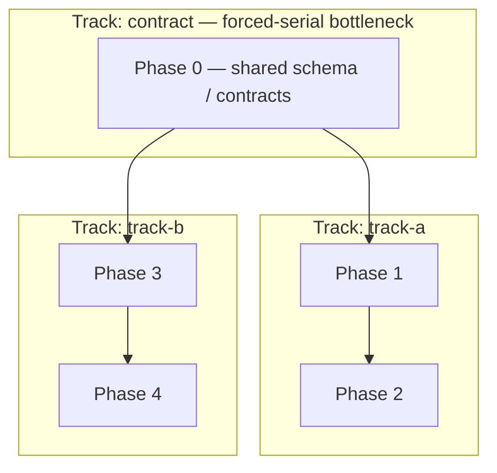

<!--
  TEMPLATE: {{TASK_TRACKER}} → write to repo root.
  This is the single source of truth for current state + the phase plan.
  Fill the phase note, deadlines, deliverable map, and phase sections with the
  project's real plan. Everything else (Currently in progress, Carry-forward,
  Decisions tabled, Log, Trims) starts EMPTY — it accretes through real work.
  Task entries are dense checkbox bullets, NOT pre-written briefs. Delete this comment.
-->

# {{TASK_TRACKER}} — {{PROJECT_NAME}}

> **Phase note.** <One paragraph: the doc's scope, any locked decisions. Refreshed when a major phase boundary is crossed.>
>
> **Reading discipline.** Read this file **by section, not whole** — `/orchestrate-start` and `/session-start` grep the section header and read only "Currently in progress" + the active phase. The living sections below (Currently-in-progress, Carry-forward, Log, Trims, Decisions) are **bounded** — pruned/archived at `/orchestrate-end`, never left to grow — so a sectioned read stays cheap even late in the project.

> **Session protocol:**
> - **At session start** — orchestrator runs `/orchestrate-start`; implementer runs `/session-start`. Confirm with the user what's targeted this session.
> - **At session end** (only when the user says we're done):
>   - **Implementer** runs `/session-end` — TDD audit + cross-doc audit + Step-9 list + create session doc + `/preflight`. Does NOT touch this doc.
>   - **Orchestrator** runs `/orchestrate-end` — verify hot routing landed, reconcile checkbox state, append Log entry, update Decisions / Carry-forward / Currently in progress, **triage Carry-forward**, round commit + push.

> **Reference deadlines:**
> - <milestone 1 — date>
> - <milestone 2 — date>

> **Spec-anchor convention (architecture-as-contract).** Each phase header below carries a `**Spec anchors:**` block listing the `{{ARCH_DOC}}` sections the phase implements. Orchestrator + implementer re-read the listed anchors at session start. If a slice surfaces a behavior the anchors don't cover, that's a cross-doc invariant flag at Step 9 — either the anchor is missing or the implementation has drifted. Architecture is contract; drift surfaces structurally, not silently. In team mode, each phase header also carries a `**Track:**` tag + a `**Depends on (phases):**` edge — the source the `## Parallelization plan` (Track map) renders from. **New tasks added mid-build** (Step-9 routing, Carry-forward INLINE-TARGET) carry `(implements §X; origin: <slice>)` — or `(ops — no contract anchor)` — on the `### <phase-id>.N` heading, with §X covered by the phase's anchors; heading-level only, the `- [ ]` field lines beneath are never individually marked.

---

## Currently in progress

<!-- REPLACE this section at every /orchestrate-end — do NOT append. It is a snapshot of NOW (≤ ~8 lines): last commit hash, suite count, next session target, active blockers. Stale lines are deleted, not stacked. -->

**Bootstrap session.** Scaffolding landed; first `/tdd` slice not yet started.

**Next session target:** <first task ID>.

---

## Carry-forward to upcoming briefs

Items the orchestrator MUST fold into the next 1–2 briefs. **Triaged at every `/orchestrate-end` (mandatory) — NOT append-only.** Each entry carries an origin marker `(origin: YYYY-MM-DD <slice-id>)`. **Bound: keep under ~7 items.** Anything over the cap, or older than ~3 slices with no consumer, is force-triaged — DELETE (done) / INLINE-TARGET (make it a real task in its phase) / DEFER (escalate). If an imminent brief doesn't need it, it doesn't live here.

_(Empty at project start; populated as Step-9 routing surfaces operational items.)_

---

## Deliverable map

| Deliverable | Status | Delivered by |
|---|---|---|
| <required deliverable 1> | ❌ / 🟡 / 🟢 | <phase> |
| <required deliverable 2> | ❌ / 🟡 / 🟢 | <phase> |

<!-- ▼ EXAMPLE BLOCK [id=deliverable-map]: deliverable map — replace rows with the project's real required outputs (docs, deployed app, reports, etc.). ▼ -->
<!-- ▲ END EXAMPLE BLOCK [id=deliverable-map] ▲ -->

---

<!-- ▼ EXAMPLE BLOCK [id=parallelization-plan]: Parallelization plan / Track map — TEAM MODE ONLY. /tasks-gen authors this from {{ARCH_DOC}} §2.5 (the subsystem dependency DAG) refined by the per-task `Depends on:` graph. It is the authority for valid `<track>` names; `/team-start <track>` reads it to scope a track's phases + provision its worktree. Delete this whole block for a single-track (serial) plan or a single-operator build. ▼ -->

## Parallelization plan (Track map)

> **Team mode only.** A *track* is a set of phases whose subsystems form a dependency-isolated region of the `{{ARCH_DOC}}` §2.5 DAG. Tracks with no unsatisfied upstream-track dependency run **in parallel — each in its own git worktree with its own agent team**. A single-track plan deletes this section.

**Phase/track DAG** (nodes = phases, edges = `Depends on (phases)`, subgraphs = tracks):

> **Critical path:** <Phase 0 → Phase 1 → Phase 2> (the serial floor on build time — staff it first). **Forced-serial bottleneck:** <Phase 0 (shared contract) — every track waits on it>.

**Track map** — the `<track>-<area>-<role>` names reuse the convention in root `CLAUDE.md` "Naming + cross-bleed prevention":

| Track | Phases | Code area(s) | Worktree (branch) | Agent-team names |
|---|---|---|---|---|
| <track-a> | <phase IDs> | <area dir(s)> | `../{{REPO_DIRNAME}}-<track-a>` (`track/<track-a>`) | `<track-a>-<area>-orchestrator` / `-implementer` |
| <track-b> | <phase IDs> | <area dir(s)> | `../{{REPO_DIRNAME}}-<track-b>` (`track/<track-b>`) | `<track-b>-<area>-orchestrator` / `-implementer` |

**Integration / merge order** (DAG topological order — a downstream track merges only after its upstream tracks):
1. <the contract track → the integration branch first (the shared contract is frozen here)>
2. <then the remaining tracks in dependency order>

**Shared contracts across tracks** (freeze before tracks fork — the `{{ARCH_DOC}}` Appendix A models crossing a §2.5 edge): <the models / files multiple tracks read>.

<!-- ▲ END EXAMPLE BLOCK [id=parallelization-plan] ▲ -->

---

## Phase exit checklist (template — applies to every phase)

Before ticking a phase complete:

- [ ] **All phase task checkboxes ticked.** Conservative — partial work stays unchecked with a Log entry note.
- [ ] **Acceptance criterion met.** `/preflight` clean + manual smoke if there's runtime behavior to validate.
- [ ] **`/preflight` clean.** Includes any architecture-invariant tests.
- [ ] **Cross-doc invariants verified.** No model field changes without a `{{ARCH_DOC}}` edit in the same round.
- [ ] **Session doc(s) for this phase exist** and list every file created/modified.
- [ ] **Commits pushed to {{GIT_REMOTE}}.**

---

## Final-submission acceptance criteria (project-level)

The project is "done" when:

- [ ] <project-level "done" condition 1>
- [ ] <project-level "done" condition 2>

---

## Phase {{PHASE_IDS}} — <phase name>

**Goal:** <one-paragraph goal>.

**Spec anchors:** `{{ARCH_DOC}} §X`, §Y.

**Track:** <track-id, or `—` for a single-track build> · **Depends on (phases):** <upstream phase IDs, or `none`>.

### <phase-id>.1 — <task name>

<!-- ▼ EXAMPLE BLOCK [id=task-entry-format]: task entry format — dense checkbox bullets, NOT a pre-written brief. The orchestrator authors the /tdd brief from this entry + carry-forward + recent context. ▼ -->

- [ ] <acceptance behavior 1>
- [ ] <acceptance behavior 2>
- [ ] Files: <concrete paths — NEW vs. extended>
- [ ] Cross-doc invariant: <NEW / extended / none>
- [ ] Depends on: <task IDs whose tests/impl this requires, or `none`>

<!-- OPTIONAL `Implements: REQ-x[, REQ-y]` line — add ONLY when one § maps to multiple REQs and this
     task covers a strict subset of them. Otherwise REQ→task coverage is DERIVED, never restated: the
     phase's `Spec anchors:` line + the {{ARCH_DOC}} Spec Anchor Index already map REQ → § → task, and a
     per-task REQ line would be a third drifting copy of that mapping. -->

<!-- ▲ END EXAMPLE BLOCK [id=task-entry-format] ▲ -->

### <phase-id>.2 — <task name>

- [ ] ...

### Acceptance criteria (<phase-id>)

- [ ] All <phase-id>.X task checkboxes ticked.
- [ ] <phase-specific criteria>

---

<!-- Repeat the phase block for each phase in the plan. -->

---

<!-- ▼ EXAMPLE BLOCK [id=optional-demo-phase]: OPTIONAL Demo phase — include ONLY if a demo / live walkthrough is an explicit deliverable. Check the **Build posture** in {{ARCH_DOC}}: a production-grade build usually OMITS this phase (ship a deployable/operable slice instead); an MVP/prototype build makes it the natural near-final slice. Delete this whole block when no demo is in scope. ▼ -->

## Phase D — Demo (OPTIONAL)

> **Optional phase.** Included only when a demo / live walkthrough is an explicit deliverable. A demo is **never** a substitute for the invariant → lifecycle → test → hardening work above — it sits *after* the system is correct, not in place of it.

**Goal:** <the narrowest end-to-end path the demo must prove>.

**Spec anchors:** `{{ARCH_DOC}} §X` — the flows the demo exercises.

### D.1 — <demo slice>

- [ ] <demo acceptance behavior — the happy path that runs end-to-end>
- [ ] Files: <demo entrypoint / seed data / script — NEW vs. extended>
- [ ] Cross-doc invariant: none (a demo must not introduce new contract surface)
- [ ] Depends on: <the spine task(s) the demo exercises>

### Acceptance criteria (D)

- [ ] The in-scope demo path runs end-to-end against the real system (no mocks on the load-bearing path).
- [ ] No invariant / test / hardening task was cut to make the demo work.

<!-- ▲ END EXAMPLE BLOCK [id=optional-demo-phase] ▲ -->

---

## Trims / Nice-to-Haves Catalog

Deferred items with come-back guidance: why deferred, where it belongs, files to modify, tests to add, cross-doc invariant impact. **Prune at `/orchestrate-end`:** a Trim that ships moves to its phase as `[x]`; an obsoleted Trim is deleted with a one-line Log note.

_(Empty at project start; populated as scope cuts surface.)_

---

## Decisions tabled

Open scope/design questions awaiting resolution, with rationale. **Resolved entries move into the Log (with the resolution) and out of here** — this holds only *open* questions.

_(Empty at project start.)_

---

## Log

The orchestrator's framing of each round, date-stamped. **Bounded, not unbounded-append:** keep the most recent ~10 rounds inline; roll older entries into `docs/sessions/` (the technical narrative) or `docs/archive/TASKS-LOG.md`, leaving a one-line pointer here. Readers only ever load the recent entries, so the inline Log stays small. (Archive — never delete — the round history is an audit trail.)

_(Empty at project start; populated at every `/orchestrate-end`.)_
