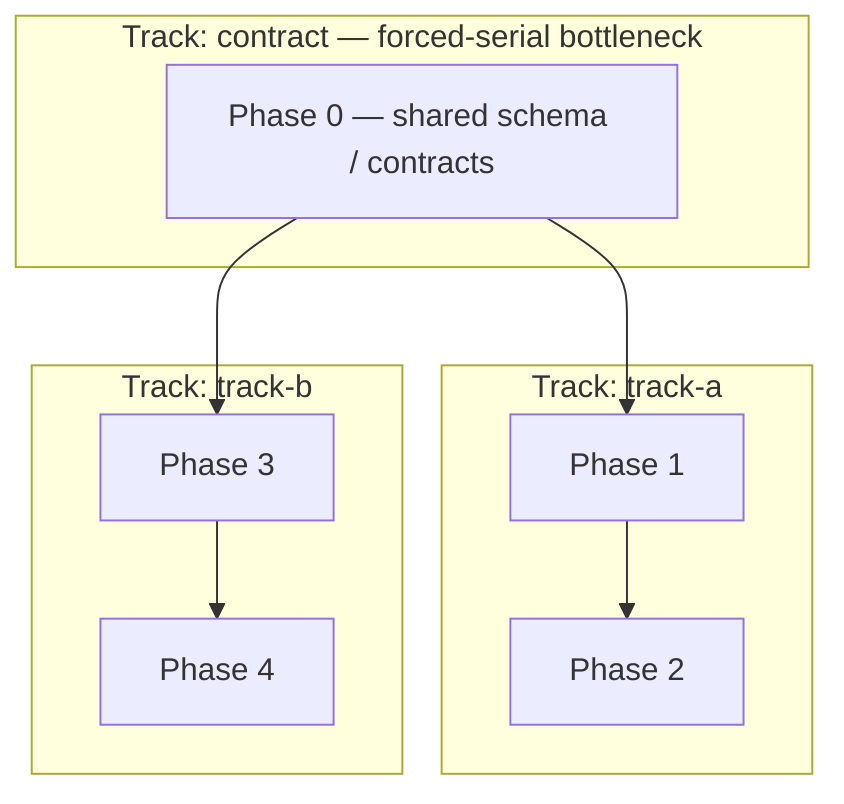

<!--
  TEMPLATE: {{TASK_TRACKER}} → write to repo root.
  This is the single source of truth for current state + the phase plan.
  Fill the phase note, deadlines, deliverable map, and phase sections with the
  project's real plan. Everything else (Currently in progress, Carry-forward,
  Decisions tabled, Trims) starts EMPTY — it accretes through real work.
  Task entries carry ONE state-checkbox line + fielded metadata + a dense prose sketch, NOT pre-written briefs. Delete this comment.
-->

# {{TASK_TRACKER}} — {{PROJECT_NAME}}

> **Phase note.** <One paragraph: the doc's scope, any locked decisions. Refreshed when a major phase boundary is crossed.>
>
> **Reading discipline.** Read this file **by section, not whole** — `/orchestrate-start` and `/session-start` grep the section header and read only "Currently in progress" + the active phase. Round history lives in `docs/archive/IMPLEMENTATION_LOG.md`, never here.

> **Format contract (lint-enforced by `scripts/plan-lint.sh` at every `/orchestrate-end`).**
> - **Task state** lives on ONE checkbox line — the first content line under each `### N.M` heading: `- [x] DONE · `hash` · YYYY-MM-DD` / `- [~] PARTIAL · remaining: …` / `- [ ] OPEN` / `- [ ] DEFERRED · …` / `- [ ] OWNER-GATED · §ARM-… / §DEC-…`. Headings carry **no** state tokens; completion never lives in prose.
> - **Currently in progress** — `≤3` items / `≤15` lines, **REPLACED** each round (a snapshot of NOW, not a history).
> - **Carry-forward** — `≤7` items; resolved items **deleted** (never annotated); overflow → the owning phase's `#### Residuals`.
> - **Round history** — only in `docs/archive/IMPLEMENTATION_LOG.md`; this file has **no** inline Log.
> - **Owner gates & arming ledgers** — a dedicated section; every `OWNER-GATED` task references a `§ARM-*/§DEC-*` id defined there.
> - **Every task** carries a `**Spec:**` `{{ARCH_DOC}} §` anchor or an explicit `arch_gap` flag.
> - **Phase-exit checklists** live in `docs/archive/`; the phase body keeps a one-line `**Gate:**` pointer.

> **Session protocol:**
> - **At session start** — orchestrator runs `/orchestrate-start`; implementer runs `/session-start`. Confirm with the user what's targeted this session.
> - **At session end** (only when the user says we're done):
>   - **Implementer** runs `/session-end` — TDD audit + cross-doc audit + Step-9 list + create session doc + `/preflight`. Does NOT touch this doc.
>   - **Orchestrator** runs `/orchestrate-end` — verify hot routing landed, reconcile checkbox state, append the round's Log entry to `docs/archive/IMPLEMENTATION_LOG.md`, update Decisions / Carry-forward / Currently in progress, **triage Carry-forward**, round commit + push.

> **Reference deadlines:**
> - <milestone 1 — date>
> - <milestone 2 — date>

> **Spec-anchor convention (architecture-as-contract).** Each phase header below carries a `**Spec anchors:**` block listing the `{{ARCH_DOC}}` sections the phase implements. Orchestrator + implementer re-read the listed anchors at session start. If a slice surfaces a behavior the anchors don't cover, that's a cross-doc invariant flag at Step 9 — either the anchor is missing or the implementation has drifted. Architecture is contract; drift surfaces structurally, not silently. In team mode, each phase header also carries a `**Track:**` tag + a `**Depends on (phases):**` edge — the source the `## Parallelization plan` (Track map) renders from. **New tasks added mid-build** (Step-9 routing, Carry-forward INLINE-TARGET) carry `(implements §X; origin: <slice>)` — or `(ops — no contract anchor)` — on the `### <phase-id>.N` heading, with §X covered by the phase's anchors; heading-level only — the task's single State-checkbox line (the first content line under the heading) carries completion, and the `**Kind:** / **Spec:** / **Depends:** / **Blocks:** / **Files:**` metadata lines beneath it are plain fields, never checkboxes.

---

## Phase status (at a glance)

<!-- Dashboard of phase-level state — one row per phase, REPLACED at every /orchestrate-end (a projection
     of NOW, not a history). Plain machinery (no EXAMPLE-BLOCK marker). `Open` = tasks not yet DONE-class
     (open + partial + deferred + owner-gated). States: ✅ done · 🔶 active · ⬜ open · ⛔ owner-gated.
     Delete this section for a small plan whose phase headings already read at a glance. -->

| Ph | Title | Track | State | Gate | Open | Anchor |
|----|-------|-------|-------|------|------|--------|
| 0 | <phase 0 title> | — | ⬜ open | — | <n> | §X |
| 1 | <phase 1 title> | <track> | ⬜ open | — | <n> | §Y |

---

## Currently in progress

<!-- REPLACE this section at every /orchestrate-end — do NOT append. It is a snapshot of NOW (≤3 items / ≤15 lines): last commit hash, suite count, next session target, active blockers. Stale lines are deleted, not stacked. -->

**Bootstrap session.** Scaffolding landed; first `/tdd` slice not yet started.

**Next session target:** <first task ID>.

---

## Carry-forward to upcoming briefs

Items the orchestrator MUST fold into the next 1–2 briefs. **Triaged at every `/orchestrate-end` (mandatory) — NOT append-only.** Each entry carries an origin marker `(origin: YYYY-MM-DD <slice-id>)`. **Bound: keep under ~7 items.** Anything over the cap, or older than ~3 slices with no consumer, is force-triaged — DELETE (done) / INLINE-TARGET (make it a real task in its phase) / DEFER (escalate). If an imminent brief doesn't need it, it doesn't live here. Resolved items are DELETED with an archive pointer (never annotated in place); overflow past ~7 goes to the owning phase's `#### Residuals`, not here.

_(Empty at project start; populated as Step-9 routing surfaces operational items.)_

---

## Owner gates & arming ledgers

<!-- Delete this whole section if the project has no owner-gated crossings (no `OWNER-GATED` tasks).
     Ship as PLAIN machinery (no EXAMPLE-BLOCK marker) so the §10 census is unchanged. Every task whose
     State line reads `- [ ] OWNER-GATED · §ARM-…/§DEC-…` MUST reference an id defined here, and every id
     defined here should be referenced by a task — `scripts/plan-lint.sh` pairs the two (an unreferenced
     ledger id or a dangling task reference is a lint failure). One `### §ARM-<slug>` per armable crossing
     (dormant machinery may be built + reviewed freely; NOTHING arms without explicit owner sign-off
     recorded in its ledger); one `### §DEC-<slug>` per tabled owner decision. -->

> ⛔ **Every entry here is an owner-gated HARD LINE — escalate-before-crossing with EXPLICIT owner confirm PER crossing.** <List the project's standing hard lines: the irreversible / real-egress / real-external-write / paid-key crossings this build gates. Delete this section if there are none.>

### §ARM-<slug> — <what this crossing arms>

- **Gate:** <PENDING | ARMED | FIRED> · **Owner sign-off:** <ref, or `none yet`>.
- **Arms:** <the task IDs / behavior this ledger releases>.
- **Preconditions:** <what must be green/true before arming>.
- **Evidence:** <commit / report / receipt paths, once fired>.

### §DEC-<slug> — <the tabled owner decision>

- **Status:** <OPEN | DECIDED> · **Decision:** <the ruling once made, or `awaiting owner`>.
- **Blocks:** <the task IDs waiting on this decision>.

---

## Deliverable map

| Deliverable | Status | Delivered by |
|---|---|---|
| <required deliverable 1> | ❌ / 🟡 / 🟢 | <phase> |
| <required deliverable 2> | ❌ / 🟡 / 🟢 | <phase> |

<!-- ▼ EXAMPLE BLOCK [id=deliverable-map]: deliverable map — replace rows with the project's real required outputs (docs, deployed app, reports, etc.). ▼ -->
<!-- ▲ END EXAMPLE BLOCK [id=deliverable-map] ▲ -->

---

<!-- ▼ EXAMPLE BLOCK [id=parallelization-plan]: Parallelization plan / Track map — TEAM MODE ONLY. /tasks-gen authors this from {{ARCH_DOC}} §2.5 (the subsystem dependency DAG) refined by the per-task `Depends on:` graph. It is the authority for valid `<track>` names; `/team-start <track>` reads it to scope a track's phases + provision its worktree. Delete this whole block for a single-track (serial) plan or a single-operator build. ▼ -->

## Parallelization plan (Track map)

> **Team mode only.** A *track* is a set of phases whose subsystems form a dependency-isolated region of the `{{ARCH_DOC}}` §2.5 DAG. Tracks with no unsatisfied upstream-track dependency run **in parallel — each in its own git worktree with its own agent team**. A single-track plan deletes this section.

**Phase/track DAG** (nodes = phases, edges = `Depends on (phases)`, subgraphs = tracks):

> **Critical path:** <Phase 0 → Phase 1 → Phase 2> (the serial floor on build time — staff it first). **Forced-serial bottleneck:** <Phase 0 (shared contract) — every track waits on it>.

**Track map** — the `<track>-<area>-<role>` names reuse the convention in root `{{ROOT_MEMORY}}` "Naming + numbered-doc collision prevention":

| Track | Phases | Code area(s) | Worktree (branch) | Agent-team names |
|---|---|---|---|---|
| <track-a> | <phase IDs> | <area dir(s)> | `../{{REPO_DIRNAME}}-<track-a>` (`track/<track-a>`) | `<track-a>-<area>-orchestrator` / `-implementer` |
| <track-b> | <phase IDs> | <area dir(s)> | `../{{REPO_DIRNAME}}-<track-b>` (`track/<track-b>`) | `<track-b>-<area>-orchestrator` / `-implementer` |

**Integration / merge order** (DAG topological order — a downstream track merges only after its upstream tracks):
1. <the contract track → the integration branch first (the shared contract is frozen here)>
2. <then the remaining tracks in dependency order>

**Shared contracts across tracks** (freeze before tracks fork — the `{{ARCH_DOC}}` Appendix A models crossing a §2.5 edge): <the models / files multiple tracks read>.

<!-- ▲ END EXAMPLE BLOCK [id=parallelization-plan] ▲ -->

---

## Phase exit checklist (template — applies to every phase)

Before ticking a phase complete (**executed row-by-row by `/phase-exit <phase>`** — the orchestrator
dispatches it at the START of a round). Per-phase copies of this checklist materialize in
`docs/archive/phase-exit-<phase>.md` (not inline in the plan); each row is ticked in place there as it
passes, and the phase body keeps only a one-line `**Gate:** <PENDING|CLEAR|BLOCKED> — see docs/archive/phase-exit-<phase>.md` pointer.

- [ ] **All phase task State lines are DONE-class.** Conservative — partial work stays a `- [~] PARTIAL` State line with an archive-log note.
- [ ] **Acceptance criterion met.** `/preflight` clean + manual smoke if there's runtime behavior to validate.
- [ ] **`/preflight` clean.** Includes any architecture-invariant tests.
- [ ] **Cross-doc invariants verified.** No model field changes without a `{{ARCH_DOC}}` edit in the same round.
- [ ] **Reachability audit clean per touched area** (`reachability-auditor`).
- [ ] **Arch-drift audit clean over the phase's Spec anchors** (`arch-drift-auditor`).
- [ ] **Spec coverage: every phase anchor has a tagged test or waiver** (`scripts/spec-lint.sh tests <phase>`).

<!-- Posture-gated rows (production-grade default; each individually confirmed at generation via the
     gate-pack question and recorded in the manifest — delete a row ONLY per that recorded answer): -->
- [ ] **Dependency audit: no NEW findings vs the accepted-risk baseline** — `/phase-exit` runs `{{AUDIT_CMD}}` once; one-line new-vs-baseline summary (full output → `docs/audits/`); a new finding is accepted-risk-recorded in Decisions tabled or escalated as a **Finding**. _(production-grade)_
- [ ] **Whole-system security review clean (qualifying phases).** Qualifies when the phase carries security-/invariant-tagged tasks or trust-boundary surfaces (per `THREAT_MODEL.md` when it exists, else the architecture's risk/security anchors). Executor resolves from `{{SECURITY_REVIEW_POLICY}}`: at `phase-boundary`, the gate's security-reviewer dispatch (phase-diff surface) **is** this review — one combined gate, never a second pass; otherwise the default tool is the built-in `/security-review` over the branch's pending changes (the track's accumulated diff), with gstack `/cso` as the heavier escalation when installed and trust-boundary anchors are in scope. Critical findings escalate as **Findings**. _(production-grade)_
- [ ] **Perf budgets met, or the regression is flagged as a Finding** — run the phase's benchmark task(s) against the `{{ARCH_DOC}}` budgets; phases with no stated budgets tick with `n/a — no budgets (deliberate deferral recorded)`. _(production-grade, when budgets exist)_

- [ ] **Session doc(s) for this phase exist** and list every file created/modified.
- [ ] **Commits pushed to {{GIT_REMOTE}}.**

---

## Final-submission acceptance criteria (project-level)

The project is "done" when:

- [ ] <project-level "done" condition 1>
- [ ] <project-level "done" condition 2>

---

## Phase {{PHASE_IDS}} — <phase name>

**Goal:** <one-paragraph goal>.

**Spec anchors:** `{{ARCH_DOC}} §X`, §Y.

**Track:** <track-id, or `—` for a single-track build> · **Depends on (phases):** <upstream phase IDs, or `none`>.

### <phase-id>.1 — <task name>

<!-- ▼ EXAMPLE BLOCK [id=task-entry-format]: task entry format — dense checkbox bullets, NOT a pre-written brief. The orchestrator authors the /tdd brief from this entry + carry-forward + recent context. ▼ -->

- [ ] OPEN
**Kind:** <deterministic /tdd | eval | ops> · **Spec:** {{ARCH_DOC}} §X (or `arch_gap`) · **Depends:** <task IDs whose tests/impl this requires, or `none`> · **Blocks:** <task IDs this unblocks, or `none`>
**Files:** <concrete paths — NEW vs. extended>

<One dense acceptance paragraph: the behaviors this task must exhibit, the edge/error cases it pins, and the cross-doc invariant it touches (NEW / extended / none) — enough for the orchestrator to author the /tdd brief, not a brief itself.>

<!-- State vocabulary — the FIRST content line under each `### N.M` heading is exactly one State checkbox:
     `- [x] DONE · `hash` · YYYY-MM-DD` · `- [~] PARTIAL · remaining: … → target` · `- [ ] OPEN` ·
     `- [ ] DEFERRED · <target> · owner-approved ref` · `- [ ] OWNER-GATED · §ARM-… / §DEC-…`.
     Headings carry no state tokens; the metadata lines above are plain fields, never checkboxes. -->

<!-- OPTIONAL `Implements: REQ-x[, REQ-y]` line — add ONLY when one § maps to multiple REQs and this
     task covers a strict subset of them. Otherwise REQ→task coverage is DERIVED, never restated: the
     phase's `Spec anchors:` line + the {{ARCH_DOC}} Spec Anchor Index already map REQ → § → task, and a
     per-task REQ line would be a third drifting copy of that mapping. -->

<!-- ▲ END EXAMPLE BLOCK [id=task-entry-format] ▲ -->

### <phase-id>.2 — <task name>

- [ ] OPEN
… (fielded metadata + dense acceptance sketch, as in `.1`)

### Acceptance criteria (<phase-id>)

- [ ] All <phase-id>.X task State lines DONE-class.
- [ ] <phase-specific criteria>

---

<!-- Repeat the phase block for each phase in the plan. -->

---

<!-- ▼ EXAMPLE BLOCK [id=optional-demo-phase]: OPTIONAL Demo phase — include ONLY if a demo / live walkthrough is an explicit deliverable. Check the **Build posture** in {{ARCH_DOC}}: a production-grade build usually OMITS this phase (ship a deployable/operable slice instead); an MVP/prototype build makes it the natural near-final slice. Delete this whole block when no demo is in scope. ▼ -->

## Phase D — Demo (OPTIONAL)

> **Optional phase.** Included only when a demo / live walkthrough is an explicit deliverable. A demo is **never** a substitute for the invariant → lifecycle → test → hardening work above — it sits *after* the system is correct, not in place of it.

**Goal:** <the narrowest end-to-end path the demo must prove>.

**Spec anchors:** `{{ARCH_DOC}} §X` — the flows the demo exercises.

### D.1 — <demo slice>

- [ ] OPEN
**Kind:** demo · **Spec:** `{{ARCH_DOC}} §X` (the flows the demo exercises) · **Depends:** <the spine task(s) the demo exercises> · **Blocks:** —
**Files:** <demo entrypoint / seed data / script — NEW vs. extended; cross-doc invariant: none — a demo must not introduce new contract surface>
<demo acceptance behavior — the happy path that runs end-to-end>

### Acceptance criteria (D)

- [ ] OPEN — the in-scope demo path runs end-to-end against the real system (no mocks on the load-bearing path); no invariant / test / hardening task was cut to make the demo work.

<!-- ▲ END EXAMPLE BLOCK [id=optional-demo-phase] ▲ -->

---

## Trims / Nice-to-Haves Catalog

Deferred items with come-back guidance: why deferred, where it belongs, files to modify, tests to add, cross-doc invariant impact. **Prune at `/orchestrate-end`:** a Trim that ships moves to its phase as `[x]`; an obsoleted Trim is deleted with a one-line note in `docs/archive/IMPLEMENTATION_LOG.md`.

_(Empty at project start; populated as scope cuts surface.)_

---

## Decisions tabled

Open scope/design questions awaiting resolution, with rationale. **Resolved entries move into `docs/archive/IMPLEMENTATION_LOG.md` (with the resolution) and out of here** — this holds only *open* questions.

_(Empty at project start.)_

---

## Log

Round history is **not** kept in this file. See docs/archive/IMPLEMENTATION_LOG.md (append-only, orchestrator-written at every /orchestrate-end).
